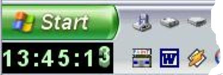



## Yet another clock\.\.\.

### Description

... but this one uses no space on your desktop because it runs in the system tray below the start button. The numbers roll like in an odometer. All you have to do to accomodate it is to unfix the tray (right click into it to open the menu), size it to two units height by gripping it at the top with your mouse, and then fix again. Download is 11.9 kB. Update: Update: The clock now decides whether it sits on top of or below the start button. When it sits on top of the start button, it will disappear when you move the mouse over it and re-appear after five seconds (possibly cancelling the initial start menue).
 
### More Info
 
Tested with XP only.

             |
---                |---
**Submitted On**   |2008-01-28 06:00:02
**By**             |[ULLI](https://github.com/Planet-Source-Code/PSCIndex/blob/master/ByAuthor/ulli.md)
**Level**          |Intermediate
**User Rating**    |4.8 (29 globes from 6 users)
**Compatibility**  |VB 6\.0
**Category**       |[Graphics](https://github.com/Planet-Source-Code/PSCIndex/blob/master/ByCategory/graphics__1-46.md)
**World**          |[Visual Basic](https://github.com/Planet-Source-Code/PSCIndex/blob/master/ByWorld/visual-basic.md)
**Archive File**   |[Yet\_anothe2099551282008\.zip](https://github.com/Planet-Source-Code/ulli-yet-another-clock__1-69983/archive/master.zip)

